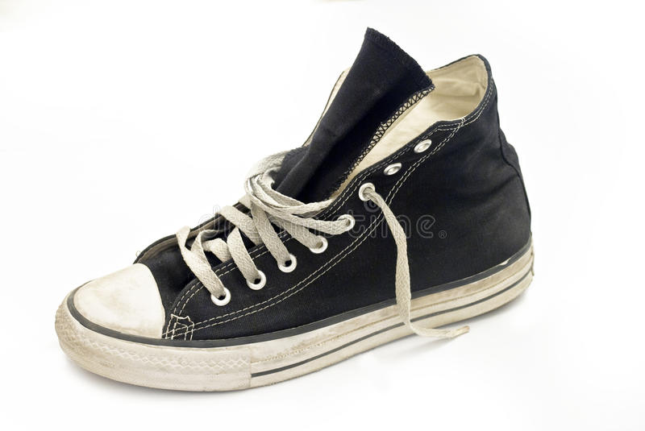

```{r setup, include=FALSE}
knitr::opts_chunk$set(echo = TRUE, 
                      fig.align = "center", out.width = '90%',
                      message=FALSE, warning=FALSE)
```


# Pre-lecture materials

### Read ahead

:::resources

**Before class, you can prepare by reading the following materials:**

1. 

:::


### Acknowledgements

Material for this lecture was borrowed and adopted from

- [An Introduction to Statistical Learning, 2013](https://www.springer.com/us/book/9781461471370) by James, Witten, Hastie and Tibshirani
- The [dsbook](https://rafalab.github.io/dsbook) from Rafael Irizarry

# Learning objectives

:::keyideas

**At the end of this lesson you will:**

- 
- 
- 

:::


# Motivation

In the previous lectures, we have learned about machine 
learning algorithms, where decisions made are 
based on algorithms built on data. The data we have often 
comes in the form of an _outcome_ we want to predict and 
the _features_ that we will use to predict the outcome.
This setting is often called a **supervised learning** (as 
opposed to the **unsupervised learning** setting without 
an _outcome_ variable, such as clustering or dimensionality reduction). 

:::keyideas 

The **general idea** of supervised learning is that we 
build the algorithm using the
data that includes the outcome so that in the future we 
can predict the outcome only using the features. Here we 
will use $Y$ to denote the outcome and $X_1, \dots, X_p$ 
to denote features. 

**Note**: the features are sometimes 
referred to as **predictors** or **covariates** and the outcome 
is sometimes referred to as a **response variable**. 

:::

If the outcome $Y$ is quantitative, something like linear
regression is very useful for predicting a quantitative
response. But in many situations, the responsible variable
is qualitative (or categorical). 

Predicting a qualitative 
response $Y$ is referred to as **classification** since it 
involves assigning each observation to a category or class. 

So the general set-up is as follows. Given a set of 
predictors $X_{ij}$ and and qualitative outcome $Y_i$,
we can collect data to _classify_ or _predict_ which 
class or category each outcome (or observation) 
belongs in: 

```{r,echo=FALSE}
library(tidyverse)
n <- 10
tmp <- data.frame(outcome=paste0("Y_",1:n), 
                  feature_1 = paste0("X_",1:n,",1"),
                  feature_2 = paste0("X_",1:n,",2"),
                  feature_3 = paste0("X_",1:n,",3"),
                  feature_4 = paste0("X_",1:n,",4"),
                  feature_5 = paste0("X_",1:n,",5"))
tmp %>% knitr::kable(align="c")
```

### Three widely used linear classifiers

Today, we will focus on the three of the most widely used
classifiers: 

1. Linear and Logistic regression
2. Linear and Quadratic discriminant analysis
3. $K$-nearest neighbors

You have already learned about other methods including, 
trees, random forests, and boosting. Next week, we will cover 
support vector machines. 

# Data 

For this lecture, we will use the 
[Fashion-MNIST](https://www.kaggle.com/zalando-research/fashionmnist)
dataset from Kaggle. 


The motivating question is:

**Can we build a classier to accurately classify images of pieces of clothing?**

The data consists of a training set of 60,000 
images and a test set of 10,000 examples. We will 
assume the test set is the only data available for the 
purposes of this lecture (mostly because it is 1/6 of the 
size of the training set!).

For example, we want to build a classifier to recognize 
this image as a pair of pants: 

```{r pants, echo=FALSE}
knitr::include_graphics("../../images/pants.jpg")
```

And the classifier should be able to recognize 
this image as shoe: 

```{r shoe, echo=FALSE}

```

The fashion MNIST dataset contains a set of images of 
clothing or fashion pieces. Each observation $Y_i$ 
is labeled one of the following: 

* `0` = T-shirt/top
* `1` = Trouser
* `2` = Pullover
* `3` = Dress
* `4` = Coat
* `5` = Sandal
* `6` = Shirt
* `7` = Sneaker
* `8` = Bag
* `9` = Ankle boot 

The are images are converted into $28 \times 28$ pixels and for 
each we obtain an gray scale intensity between 0 (white) 
to 256 (black). 

We will explore this data set using 
some common machine learning algorithms for classification. 

## Data import 

First, we load a few R packages

```{r}
library(tidyverse)
library(magrittr)
library(caret)
library(pROC)
library(here)
```

The data are available in the `/data` folder of this repository. 

First, let's read in the `fashion-mnist_test.csv` dataset
using the `read_csv()` function in the `readr` package.

```{r}
if(!exists("fashion")) { 
  fashion <- read_csv(here("data", "fashion-mnist_test.csv"))
}
```

Here we save just pixels

```{r}
X <- 
  fashion %>% 
  select(-label) %>% 
  as.matrix()
dim(X)
```

And we also save the labels (i.e. 0-9)

```{r}
fashion_labels <- 
  fashion %>% 
  pull(label)
```

We can look at the first three images to see what they look like. 

```{r}
tmp <- lapply(c(1:3), function(i){
    expand.grid(Row=1:28, Column=1:28) %>%  
      mutate(id=i, label=fashion$label[i],  
             value = unlist(fashion[i,-1])) })
tmp <- Reduce(rbind, tmp)
tmp %>% ggplot(aes(Row, Column, fill=value)) + 
    geom_raster() + 
    scale_y_reverse() +
    scale_fill_gradient(low="white", high="black") +
    facet_grid(.~label)
```


### What are the features? 

Each image is converted into $28 \times 28$ pixels 
and for each we obtain an grey scale intensity 
between `0` (white) to `255` (black). 

This means one image has 784 (=28*28) features.

We can see these values like this:

```{r}
tmp %>% ggplot(aes(Row, Column, fill=value)) + 
    geom_point(pch=21,cex=2) + 
    scale_y_reverse() +
    scale_fill_gradient(low="white", high="black") +
    facet_grid(.~label)
```

We use bold face to denote this vector of predictors 

$$ \mathbf{X}_i = (X_{i,1}, \dots, X_{i,784}) $$

Let's take a peek at $\mathbf{X}$: 

```{r}
X[1:10, 1:10]
```


### What are the outcomes? 

Even though the `label` here is a whole number between 
0 and 10, this is a qualitative outcome (e.g. shirt, 
pants, shoes, etc). 

```{r}
fashion_labels[1:7]
```


So for each image $i$ we have an outcome $Y_i$
which can be one of 10 categories: $0,1,2,3,4,5,6,7,8,9$
and the features $X_{i,1}, \dots, X_{i,784}$ which 
can take values from 0 to 255. 


### How does this related to machine learning?

The machine learning task here 
is to build a predictor function, $f$ that converts
$\mathbf{X}$ into a prediction category 
$\hat{Y}_i = f(\mathbf{X}_i)$ that minimizes the 
$d(Y,\hat{Y})$


### Calculating the top PCs

If you recall, the first PC is will explain the most 
variation, the second PC will explain the second most 
variation in the data, etc. 

Because the pixels are so small we expect those to 
be close to each other on the grid to be correlated, 
meaning that dimension reduction should be possible.

Let's take the SVD of $\mathbf{X}$. 

```{r}
dim(X) #  10000 observation, 784 features
```

Remember, we need to column center the data. We also
will create a new variable $\mathbf{Y}$ to represent
the standardized data that is also transposed
(features along rows).

```{r}
Y <- t(scale(X,center=TRUE, scale=FALSE)) 
dim(Y)
```

Now apply the `svd()` function to $\mathbf{Y}$.

```{r}
s <- svd(Y)
str(s)
```

First note that we can in fact reconstruct
$\mathbf{Y}$ using all the PCs:

```{r}
Yhat <- s$u %*% diag(s$d) %*% t(s$v)
resid <- Y - Yhat
max(abs(resid))
```

If we look at the eigenvalues in $\mathbf{D}$, 
we see that the last few are quite close to 0.  

```{r}
plot(s$d)
```

This implies that the last columns of $\mathbf{V}$ have a very 
small effect on the reconstruction of $\mathbf{X}$. To see this, 
consider the extreme example in which the last entry 
of $\mathbf{V}$ is 0. In this case the last column of 
$\mathbf{V}$ is not needed at all. 

Because of the way 
the SVD is created, the columns of $\mathbf{V}$, have 
less and less influence on the reconstruction of 
$\mathbf{X}$. You commonly see this described as 
"explaining less variance". This implies that for a 
large matrix, by the time you get to the last columns, 
it is possible that there is not much left to "explain".

As an example, we will look at what happens if we remove
the 100 last columns:

```{r}
k <- ncol(s$v)-100
Yhat <- s$u[,1:k] %*% diag(s$d)[1:k,1:k] %*% t(s$v[,1:k])
resid <- Y - Yhat 
max(abs(resid))
```

The largest residual is practically 0, meaning that
`Yhat` is practically the same as `Y`, yet we need 
100 less dimensions to transmit the information.

By looking at $\mathbf{D}$, we can see that, in this particular
dataset, we can obtain a good approximation keeping
only a subset of columns. The following plots are useful 
for seeing how much of the variability is explained by each column:


```{r}
plot(s$d^2/sum(s$d^2)*100,
     ylab="Percent variability explained")
```

We can also make a cumulative plot:

```{r}
plot(cumsum(s$d^2)/sum(s$d^2)*100,
     ylab="Percent variability explained",
     ylim=c(0,100), type="l")
```

Although we start with 784 dimensions, we can 
approximate $X$ with just a few:

```{r}
k <- 100 ## out a possible 784
Yhat <- s$u[,1:k] %*% diag(s$d)[1:k,1:k] %*% t(s$v[,1:k])
resid <- Y - Yhat
```

Therefore, by using only 100 dimensions, 
we retain most of the variability in our data:

```{r}
1 - var(as.vector(resid))/var(as.vector(Y))
```

We say that we explain 
`r round((1 - var(as.vector(resid))/var(as.vector(Y)))*100)` 
percent of the variability in our data with 
`r k` PCs.

Note that we can compute this proportion from 
$\mathbf{D}$:

```{r}
sum(s$d[1:k]^2)/sum(s$d^2)
```

The entries of $\mathbf{D}$ therefore tell us how much each 
PC contributes in term of variability explained.

Another way of calculating the PCs is to use `prcomp()` 
function.

```{r}
pc <- prcomp(X, center=TRUE)
```

The proportion of variance of the first ten PCs is quite
high (almost 75%): 

```{r}
summary(pc)$importance[,1:10]
```

We can also plot the standard deviations:

```{r}
plot(pc$sdev)
```

or the more common plot variance explained:

```{r}
plot(pc$sdev^2 / sum(pc$sdev^2))
```

We can also see that the first two PCs will in fact be 
quite informative. Here is a plot of the first two PCs, 
but colored by the labels that we ignored:

```{r}
data.frame(PC1 = pc$x[,1], PC2 = pc$x[,2],
           label=factor(fashion_labels)) %>%
  ggplot(aes(PC1, PC2, fill=label))+
  geom_point(cex=3, pch=21)
```

We can also "see" the linear combinations on the grid
to get an idea of what is getting weighted:

```{r}
tmp <- lapply( c(1:4,781:784), function(i){
    expand.grid(Row=1:28, Column=1:28) %>%
      mutate(id=i, label=paste0("PC",i), 
             value = pc$rotation[,i])
})
tmp <- Reduce(rbind, tmp)

tmp %>% filter(id<5) %>%
  ggplot(aes(Row, Column, fill=value)) +
  geom_raster() +
  scale_y_reverse() +
  facet_wrap(~label, nrow = 1)
```

```{r}
tmp %>% filter(id>5) %>%
  ggplot(aes(Row, Column, fill=value)) +
  geom_raster() +
  scale_y_reverse() +
  facet_wrap(~label, nrow = 1)
```


# Data wrangling

For purposes of this lecture, we will focus only the 
`0`s (tshirt/top) and `5`s (sandals) observations: 

```{r}
dat05 <- fashion %>% 
  filter(fashion_labels %in% c(0,5))

## labels are not numbers
dat05 <- mutate(dat05, label = as.factor(label))
```

### Feature engineering 

To distinguish 0s (shirts) from 5s (sandals),
it might be enough to look at the number of non-white 
pixels in the upper-left and lower-right quadrants:

```{r, echo=FALSE}
tmp <- lapply( c(1:2), function(i){
    expand.grid(Row=1:28, Column=1:28) %>%  
      mutate(id=i, label=dat05$label[i],  
             value = unlist(dat05[i,-1])) 
})
tmp <- Reduce(rbind, tmp)
tmp %>% ggplot(aes(Row, Column, fill=value)) + 
    geom_raster() + 
    scale_y_reverse() +
    scale_fill_gradient(low="white", high="black") +
    facet_grid(.~label) + 
    geom_vline(xintercept = 14.5) +
    geom_hline(yintercept = 14.5)
```

So we will define two features $X_1$ and $X_2$ 
as the percent of non-white pixels in these 
two quadrants, respectively. We add these two 
features to the `dat05` table

```{r}
row_column <- expand.grid(row=1:28, col=1:28)
ind1 <- which(row_column$col <= 14 & row_column$row <=14) # top left quandrant
ind2 <- which(row_column$col > 14 & row_column$row > 14) # bottom right quadrant
ind <- c(ind1,ind2)
X <- as.matrix(dat05[,-1]) # remove label column
X <- X>200
X1 <- rowSums(X[,ind1])/rowSums(X)
X2 <- rowSums(X[,ind2])/rowSums(X)
dat05 <- mutate(dat05, X_1 = X1, X_2 = X2, 
                y = ifelse(label=="0", 0, 1))

dat05 %>% 
  select(label, y, X_1, X_2)
```

### Exploratory data analysis 

Let's explore the relationship between the predictors 
(or features) $X_1$ and $X_2$ and the outcome $Y$: 

```{r}
dat05 %>% 
  select(label, X_1, X_2) %>% 
  ggplot(aes(x=label,y=X_1)) + 
  geom_boxplot()
```

We see a pronounced relationship between the 
the predictor $X_1$ and the label (e.g. the $X_1$ 
feature is high for the t-shirts and low for the 
sandals, which make sense). 

```{r}
dat05 %>% 
  select(label, X_1, X_2) %>% 
  ggplot(aes(x=label,y=X_2)) + 
  geom_boxplot()
```

In this case, we again see a difference 
in the distribution of $X_2$ across the 
t-shirts and sandals, but less so. This is 
still likely to be informative. 

Furthermore, we can also plot the relationship
between $X_1$ and $X_2$ and see that there is 
separation between the `0`s (t-shirts)` and 
`5`s (sandals): 

```{r}
dat05 %>% 
  select(label, X_1, X_2) %>% 
  ggplot(aes(x=X_1,y=X_2, color = label)) + 
  geom_point()
```

## Create `train_set` and `test_set`

In this last step of data wrangling, we will 
split the `dat05` dataset into two parts: 

1. `train_set` = the dataset we will use to build the classifer
2. `test_set` = the dataset we will use to assess how we are doing (not used to train the classifier)

For this we will use the `createDataPartition()` function 
in the `caret` package, which you have already learned 
about in the last lecture. We set the seed so we 
will all get the same answer

```{r}
set.seed(123)
inTrain <- createDataPartition(y = dat05$label,
                               p=0.5)
train_set <- slice(dat05, inTrain$Resample1)
test_set <- slice(dat05, -inTrain$Resample1)

```

# Linear methods for classification 

### Linear regression 

One approach would be to just try using 
simple linear regression. 

This assumes that:

$$f(x) = \mbox{Pr}( Y = 1 | X_1=x_1, X_2 = x_2)  = \beta_0 + \beta_1 x_1 + \beta_2 x_2$$

and we estimate $\beta_0$, $\beta_1$, $\beta_2$ with 
least squares. Once we have estimates 
$\hat{\beta}_0$, $\hat{\beta}_1$, and $\beta_2$ we 
can obtain an actual prediction rule:

$$ \hat{f}(x) = \hat{\beta}_0+ \hat{\beta}_1 x_1 + \hat{\beta}_2 x_2 $$

The problem with using linear regression is that 
to predict $Y$ on the basis of predictors 
$\mathbf{X}_i$, we will need to order the outcomes.

Does it make sense here? Not quite. Why? 

If $Y$ is not quantiative (e.g. ten types of 
fashion pieces), it doesn't quite make sense to 
put a "t-shirt" ahead of a "sandal" or behind a 
"pants". This is because to use linear regression,
we have to decide on an ordering and if we picked
a differentordering, then that coding would produce a 
fundamentally different linear model with a different
set of predictions on the test observations. 

However, if the response variable’s values did 
take on a natural ordering, such as mild, moderate,
and severe, and we felt the gap between mild and
moderate was similar to the gap between moderate and 
severe, then a 1, 2, 3 coding would be reasonable. 

Unfortunately, in general there is no natural way 
to convert a qualitative response variable with
more than two levels into a quantitative response 
that is ready for linear regression.

### Logistic regression

If the qualitative response is binary (`0` and `1`), 
then one approach is to fit a linear regression
to this binary response and predict `1` if the 
predicted response ($\hat{Y}$) is $\hat{Y} > 0.5$ 
or `0` otherwise. 

So if we consider our linear regression model above: 

$$f(x) = \mbox{Pr}( Y = 1 | X_1=x_1, X_2 = x_2)  = \beta_0 + \beta_1 x_1 + \beta_2 x_2$$

We note that the expression on the right can be any 
real number while the expression on the left is 
bounded between 0 and 1. 

An extension that permits us to continue using 
regression-like models is to apply transformations 
that eliminate this disconnect. In the case of 
binary data the most common approach is to fit 
a _logistic regression_ model which makes use 
of the _logit_ transformation: 

$$ g(p) = \log \frac{p}{1-p}$$
and use this model instead: 

$$ g(\mbox{Pr}(Y=1 \mid X_1=x_1 , X_2 = x_2) = 
\beta_0 + \beta_1 x_1 + \beta_2 x_2$$

We can fit a logistic regression model using the
`glm()` function with the `family="binomial"` 
argument. 

```{r}
fit_glm <- glm(y ~ X_1, X_2, data = select(train_set, y, X_1, X_2), 
               family = "binomial")
summary(fit_glm)
```

We see both the $X_1$ and $X_2$ features are 
statisticially significant at the $\alpha = 0.05$
level. 

Next, if we predict or _classify_ how each 
observation $Y_i$ is doing using the `predict()` 


```{r}
pred_glm <- predict(fit_glm, newdata = test_set, type="response")
y_hat_glm <- factor(ifelse(pred_glm > 0.5, 1, 0))
tab <- table(pred=y_hat_glm, truth= test_set$y)
conf_matrix <- confusionMatrix(tab)
conf_matrix
```

The confusion table can be extracted using the 
`$table` slot

```{r}
conf_matrix$table
```

And the various performance metrics too: 

```{r}
conf_matrix$overall["Accuracy"]
```

We can also use the `roc()` function in the 
`pROC` package to plot the ROC curve comparing 
the sensitivity and specificity

```{r}
roc_glm <- roc(test_set$y, pred_glm)
plot(roc_glm)
```

#### Logistic regression for more than 2 response classes

In our example, we only considered the t-shirts and 
sandals, but we technically have more than two classes. 
If the goal is to classify a response variable or outcome 
with more than two clasess, there are multiple-class 
extensions. However, in practice they tend not to be used 
all that often. One of the reasons is that the method we 
discuss in the next section, _discriminant analysis_, is
popular for multiple-class classification. So we do not 
go into the details of multiple-class logistic regression 
here, but simply note that such an approach is possible, 
and that software for it is available in R.

### Linear discriminant analysis

Logistic regression involves directly modeling
$Pr(Y = k|X = x)$ using the logistic function, 
for the case of two response classes. An alternative 
and less direct approach to estimate these probabilities
is to model the distribution of the predictors $X$ 
separately in each of the response classes (i.e. given 
$Y$ ), and then use Bayes’ theorem to flip these around 
into estimates for $Pr(Y = k|X = x)$. 

When these distributions are assumed to be normal, 
it turns out that the model is very similar in form 
to logistic regression.

Why do we need another method, when we have logistic 
regression? There are several reasons:

1. When the classes are well-separated, the parameter estimates for the logistic regression model are surprisingly unstable. Linear discriminant analysis does not suffer from this problem.
2. If $n$ is small and the distribution of the predictors $X$ is approximately normal in each of the classes, the linear discriminant model is again more stable than the logistic regression model.
3. Linear discriminant analysis is popular when we have more than two response classes.

Ok, let's assume we have $K$ classes ($K \geq2$). 
Let $\pi_k$ represent the overall or prior probability 
that a randomly chosen observation comes from the 
$k^{th}$class or category of the response variable $Y$. 

Let $f_{k}(X) ≡ Pr(X = x|Y = k)$ denote the 
_density function_ of $X$ for an observation that 
comes from the $k^{th}$ class (i.e. $f_{k}(x)$ is relatively 
large if there is a high probability that an observation 
in the $k^{th}$ class has $X \approx x$, and $f_{k}(x)$ is 
small if it is very unlikely. Then _Bayes’ theorem_ states
that

$$ \mbox{Pr}(Y=k|X=x) = \frac{\pi_k f_{k}(x)}{\sum_{l=1}^K \pi_l f_{l}(x)} $$

So instead of directly computing $\mbox{Pr}(Y=1|X=x)$ (i.e. if $K=2$)
in logistic regression, we can plug in estimates for 
$\pi_k$ and $f_{k}(x)$. To do this, we make some assumptions
the distributions of $f_{k}(x)$, namely that they are 
multivariate normal. LDA assumes that the observations
within each class are drawn from a multivariate 
Gaussian distribution with a class-specific 
mean vector and a covariance matrix that is
common to all $K$ classes. In our case we have two predictors
($X_1$ and $X_2$), so we assume each one is bivariate normal.
This implies we need to estimate two averages, one
standard deviation, and a correlation for each case
$Y=1$ and $Y=0$. 

This implies that we can approximate the 
distributions $f_{0}(X_1, X_2)$ and $f_{1}(X_1, X_2)$. 
We can easily estimate parameters from the data:

```{r}
options(digits = 2)
train_set %>% group_by(y) %>% 
  summarize(avg_1 = mean(X_1), 
            avg_2 = mean(X_2))

train_set %>% 
  summarize(sd = sd(X_2), 
            r = cor(X_1,X_2))

```

So here are the data and contour plots showing the two normal densities:

```{r}
train_set %>% mutate(y = factor(y)) %>% 
  ggplot(aes(X_1, X_2, fill = y, color=y)) + 
  geom_point(pch=21,cex=5, color="black") + 
  stat_ellipse(lwd=2, type="norm")
```


We use the `lda()` function in the `MASS` 
R package. The `prior` argument represents 
the prior probability of class membership. 

```{r}
fit_lda <- MASS::lda(y ~ ., data=dplyr::select(train_set, y, X_1, X_2),
         prior = c(1,1)/2)
pred_lda <- MASS:::predict.lda(fit_lda, test_set)$class
```


```{r}
tab <- table(pred=pred_lda, truth= test_set$y)
conf_matrix <- confusionMatrix(tab)
conf_matrix$table
conf_matrix$overall["Accuracy"]
```


#### Quadratic discriminant analysis 

As we have discussed, LDA assumes 
that the observations within each 
class are drawn from a multivariate 
Gaussian distribution with a class-specific 
mean vector and a covariance matrix that is
common to all $K$ classes. 

_Quadratic discriminant analysis_ (QDA) assumes
that the observations from each class are again drawn 
from a Gaussian distribution and you plug in estimates
for the parameters into Bayes’ theorem in 
order to perform prediction. However, unlike LDA, 
QDA assumes that each class has its own covariance 
matrix. That is, it assumes that an observation 
from the kth class is of the form 
$X \sim N(\mu_k,\Sigma_k)$, where $\Sigma_k$ is a 
covariance matrix for the kth class. 

In our case we have two predictors
($X_1$ and $X_2$), so we assume each one 
is bivariate normal. This implies we need to
estimate two averages, two standard deviations, 
and a correlation for each case
$Y=1$ and $Y=0$. 

This implies that we can approximate the 
distributions $f_{0}(X_1, X_2)$ and $f_{1}(X_1, X_2)$. 
We can easily estimate parameters from the data:

```{r}
options(digits = 2)
params <- train_set %>% group_by(y) %>% 
  summarize(avg_1 = mean(X_1), avg_2 = mean(X_2), 
            sd_1= sd(X_1), sd_2 = sd(X_2), 
            r = cor(X_1,X_2))
params
```

So here are the data and contour plots showing the two normal densities:

```{r}
train_set %>% mutate(y = factor(y)) %>% 
  ggplot(aes(X_1, X_2, fill = y, color=y)) + 
  geom_point(pch=21,cex=5, color="black") + 
  stat_ellipse(lwd=2, type="norm")
```

We can use the `qda()` function in the `MASS` 
R package. The `prior` argument represents 
the prior probability of class membership. 

```{r}
fit_qda <- MASS::qda(y ~ ., data=select(train_set, y, X_1, X_2),
         prior = c(1,1)/2)
pred_qda <- MASS:::predict.qda(fit_qda, test_set)$class
```

```{r}
tab <- table(pred=pred_qda, truth= test_set$y)
conf_matrix <- confusionMatrix(tab)
conf_matrix$table
conf_matrix$overall["Accuracy"]
```


#### Why does it matter if we assume a common covariance matrix?

In other words, why would one prefer LDA to 
QDA, or vice-versa? The answer is the bias-variance 
trade-off. When there are $p$ predictors, then 
estimating a covariance matrix requires estimating 
$p(p+1)/2$ parameters. QDA estimates a separate 
covariance matrix for each class, for a total 
of $Kp(p+1)/2$ parameters. With 50 predictors 
this is some multiple of 1,225, which is a lot of 
parameters. By instead assuming that the $K$ classes 
share a common covariance matrix, the LDA model
becomes linear in x, which means there are $Kp$ linear
coefficients to estimate.

Consequently, LDA is a much less flexible classifier 
than QDA, and so has substantially lower variance. 
This can potentially lead to improved prediction 
performance. But there is a trade-off: if LDA’s 
assumption that the $K$ classes share a common 
covariance matrix is badly off, then LDA can suffer 
from high bias. 

Roughly speaking, LDA tends to be a better bet than 
QDA if there are relatively few training observations
and so reducing variance is crucial. In contrast, 
QDA is recommended if the training set is very large,
so that the variance of the classifier is not a major
concern, or if the assumption of a common covariance 
matrix for the $K$ classes is clearly untenable.


### $K$-nearest neighbors

A model free alternative is the $K$-nearest neighbor 
classifier (KNN). Given a positive integer $K$ and 
a test observation $x_0$, the KNN classifier first 
identifies the $K$ points in the training data that 
are closest to $x_0$, represented by $N_0$. It then 
estimates the conditional probability for class $k$ 
as the fraction of points in $N_0$ whose response 
values equal $k$:

$$\mbox{Pr}( Y = k | \mathbf{X} =\mathbf{x}_0)  = \frac{P(Y = k, \mathbf{X} = \mathbf{x}_0)}{P(\mathbf{X} = \mathbf{x}_0)} = \frac{1}{K} \sum_{i \in N_0} I(y_i = k)$$

Finally, KNN applies Bayes rule and classifies 
the test observation $x_0$ to the class with the 
largest probability.

Despite the fact that it is a very simple approach, 
KNN can often produce classifiers that are 
surprisingly close to the optimal Bayes classifier.

```{r}
fit_knn_2 <- knn3(y~., data = select(train_set, y, X_1, X_2), 
                  k=2)
pred_knn_2 <- predict(fit_knn_2, newdata = test_set)[,2]

tab <- table(pred=round(pred_knn_2), truth= test_set$y)
conf_matrix <- confusionMatrix(tab)
conf_matrix$table
conf_matrix$overall["Accuracy"]
```

**Note**: The choice of $K$ has a drastic effect 
on the KNN classifier obtained. You can explore this 
own your own by trying $K$ = 1 vs a larger $K$. 


# Post-lecture materials

### Final Questions 

Here are some post-lecture questions to help you think about the material discussed.

:::questions

**Questions:**

1. 

2. 

3.

:::


### Additional Resources 

:::resources 

- 
- 
- 

::: 


